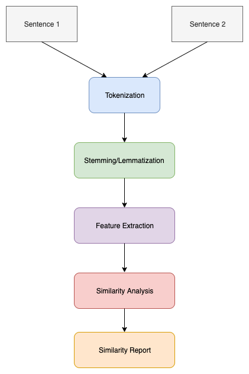

# Text_Similarity
Text similarity has to determine how 'close' two pieces of text are both in surface closeness **lexical similarity** and meaning **semantic similarity**. For instance, how similar are the phrases “the cat ate the mouse” with “the mouse ate the cat food” by just looking at the words?

## Quora Question Pairs Dataset
There are over 400,000 lines of potential question duplicate pairs. Each line contains IDs for each question in the pair, the full text for each question, and a binary value that indicates whether the line truly contains a duplicate pair.

We can download dataset from [Quora Question Pairs Dataset](https://www.kaggle.com/quora/question-pairs-dataset)

